# Esquema de Base de Datos - Reino Ajedrez

Este diagrama representa las relaciones actuales entre las tablas de la base de datos (SQLite). Puedes visualizarlo si tu editor soporta Markdown + Mermaid (o usando [Mermaid Live Editor](https://mermaid.live/)).

```mermaid
erDiagram
    %% Relaciones de Usuarios
    USERS ||--o{ CLASSES : "teacher_id (teaches)"
    USERS ||--o{ CLASS_REGISTRATIONS : "user_id (registers)"
    USERS ||--o{ COURSE_ENROLLMENTS : "user_id (enrolls)"
    USERS ||--o{ USER_LESSON_PROGRESS : "user_id (progress)"
    USERS ||--o{ USER_PUZZLE_HISTORY : "attempted"
    USERS ||--o{ USER_ACHIEVEMENTS : "earns"
    USERS ||--|| USER_STATS : "id"

    %% Relaciones de Clases
    CLASSES ||--o{ CLASS_REGISTRATIONS : "class_id"

    %% Relaciones de Cursos
    COURSES ||--o{ COURSE_ENROLLMENTS : "course_id"
    COURSES ||--o{ LESSONS : "course_id"

    %% Relaciones de Lecciones
    LESSONS ||--o{ USER_LESSON_PROGRESS : "lesson_id"

    %% Relaciones de Puzzles
    PUZZLES ||--o{ USER_PUZZLE_HISTORY : "puzzle_id"
    PUZZLES ||--o{ DAILY_PUZZLES : "assigned_to"
    DAILY_PUZZLES ||--o{ DAILY_PUZZLE_ATTEMPTS : "daily_puzzle_id"
    USERS ||--o{ DAILY_PUZZLE_ATTEMPTS : "user_id"
    ACHIEVEMENTS ||--o{ USER_ACHIEVEMENTS : "achievement_id"

    USERS {
        string id PK
        string name
        string email
        string role "student, teacher, admin"
        string status
        string subscription_plan
        string discord_id
    }

    CLASSES {
        int id PK
        string title
        string level
        datetime start_time
        string teacher_id FK
        string status "scheduled, live, completed"
        string platform
    }

    CLASS_REGISTRATIONS {
        string user_id FK
        int class_id FK
        datetime registered_at
    }

    COURSES {
        int id PK
        string title
        string level
        float price
        bool is_published
    }

    LESSONS {
        int id PK
        int course_id FK
        string title
        string content
        int order_index
    }

    COURSE_ENROLLMENTS {
        string user_id FK
        int course_id FK
        datetime enrolled_at
    }

    USER_LESSON_PROGRESS {
        string user_id FK
        int lesson_id FK
        datetime completed_at
    }

    PUZZLES {
        int id PK
        string external_id
        string fen
        string solution "JSON"
        int rating
        string tags "JSON"
    }

    USER_PUZZLE_HISTORY {
        string user_id FK
        int puzzle_id FK
        bool is_correct
    }

    USER_STATS {
        string user_id PK, FK "-> users.id"
        int rating
        int puzzles_solved
        float accuracy
        int streak
        int total_games
        float win_rate
        float study_hours
    }

    DAILY_PUZZLES {
        int id PK
        int puzzle_id FK "-> puzzles.id"
        date date UK
        datetime created_at
    }

    DAILY_PUZZLE_ATTEMPTS {
        int id PK
        string user_id FK "-> users.id"
        int daily_puzzle_id FK "-> daily_puzzles.id"
        bool solved
        int attempts
        int time_spent
        datetime completed_at
        datetime created_at
        datetime updated_at
    }

    ACTIVITY_LOG {
        int id PK
        string type
        string message
        datetime created_at
    }

    ACHIEVEMENTS {
        string id PK
        string name
        string description
        string icon_url
        string criteria_type
        int criteria_value
    }

    USER_ACHIEVEMENTS {
        string user_id FK "-> users.id"
        string achievement_id FK "-> achievements.id"
        datetime unlocked_at
    }

    DISCORD_SETTINGS {
        string key PK
        string value
    }
```

## Notas sobre las Relaciones

### Relaciones Principales:
- **USERS** es el centro del sistema, relacionándose con casi todas las tablas
- **CLASSES** tiene un profesor (teacher_id -> users.id) y múltiples estudiantes registrados
- **COURSES** contiene múltiples LESSONS y puede tener múltiples estudiantes inscritos
- **PUZZLES** registra intentos de usuarios en USER_PUZZLE_HISTORY y se asigna a DAILY_PUZZLES
- **DAILY_PUZZLES** contiene el puzzle seleccionado para cada día
- **DAILY_PUZZLE_ATTEMPTS** rastrea los intentos de los usuarios en el puzzle diario
- **USER_STATS** es una relación 1:1 con USERS para estadísticas del usuario

### Tablas de Unión (Many-to-Many):
- **CLASS_REGISTRATIONS**: Une usuarios con clases
- **COURSE_ENROLLMENTS**: Une usuarios con cursos
- **USER_LESSON_PROGRESS**: Rastrea qué lecciones ha completado cada usuario
- **USER_PUZZLE_HISTORY**: Registra intentos de puzzles por usuario

### Tablas Independientes:
- **DISCORD_SETTINGS**: Configuración global de Discord (no tiene relaciones FK)
- **ACTIVITY_LOG**: Registro de eventos del sistema para el dashboard administrativo
- **ACHIEVEMENTS**: Definición de logros disponibles en el sistema
- **USER_ACHIEVEMENTS**: Logros desbloqueados por cada usuario
